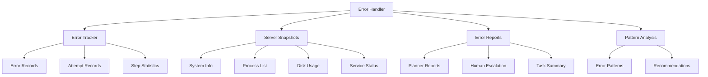

# Error Handler - Система обработки ошибок и обратной связи

## Обзор

Error Handler - это централизованная система обработки ошибок, которая обеспечивает:

- **Агрегацию ошибок** от всех компонентов системы
- **Формирование отчетов** для планировщика и человека-оператора
- **Сбор снимков состояния сервера** для диагностики
- **Анализ паттернов ошибок** и генерацию рекомендаций
- **Систему эскалации** при критических ошибках

## Архитектура



## Основные компоненты

### 1. Error Tracker Integration

Error Handler интегрируется с системой подсчета ошибок для получения детальной статистики:

```python
from agents.error_handler import ErrorHandler
from config.agent_config import AgentConfig

config = AgentConfig.from_yaml("config/agent_config.yaml")
error_handler = ErrorHandler(config, ssh_connector)

# Получение статистики ошибок
error_summary = error_handler.get_error_summary(step_id="step_1")
print(f"Ошибок: {error_summary['error_count']}")
print(f"Попыток: {error_summary['attempt_count']}")
print(f"Успешность: {error_summary['success_rate']:.1f}%")
```

### 2. Обработка ошибок шагов

```python
# Обработка ошибки шага
error_details = {
    "step_title": "Установка PostgreSQL",
    "error_count": 5,
    "timestamp": datetime.now().isoformat()
}

report = error_handler.handle_step_error(
    step_id="step_1",
    task=task,
    error_details=error_details
)

if report:
    print(f"Создан отчет: {report.report_id}")
    print(f"Тип: {report.report_type.value}")
```

### 3. Сбор снимков сервера

```python
from agents.error_handler import ServerSnapshotType

# Создание различных типов снимков
snapshots = [
    error_handler.take_server_snapshot(ServerSnapshotType.SYSTEM_INFO),
    error_handler.take_server_snapshot(ServerSnapshotType.SERVICE_STATUS),
    error_handler.take_server_snapshot(ServerSnapshotType.DISK_USAGE),
    error_handler.take_server_snapshot(ServerSnapshotType.MEMORY_USAGE),
    error_handler.take_server_snapshot(ServerSnapshotType.NETWORK_STATUS),
    error_handler.take_server_snapshot(ServerSnapshotType.LOG_ANALYSIS)
]

for snapshot in snapshots:
    print(f"Снимок {snapshot.snapshot_type.value}: {snapshot.snapshot_id}")
    print(f"Данные: {len(snapshot.data)} элементов")
```

### 4. Анализ паттернов ошибок

```python
# Анализ паттернов за последние 24 часа
patterns = error_handler.analyze_error_patterns(time_window_hours=24)

for pattern in patterns:
    print(f"Паттерн: {pattern.pattern_name}")
    print(f"Частота: {pattern.frequency}")
    print(f"Затронутые шаги: {pattern.affected_steps}")
    print(f"Решения: {pattern.suggested_solutions}")
```

### 5. Система эскалации

```python
# Регистрация колбэков для уведомлений
def planner_callback(report):
    print(f"Отчет для планировщика: {report.title}")
    print(f"Рекомендации: {len(report.recommendations)}")

def human_escalation_callback(report):
    print(f"КРИТИЧЕСКАЯ ЭСКАЛАЦИЯ: {report.title}")
    print(f"Снимков сервера: {len(report.server_snapshots)}")

error_handler.register_planner_callback(planner_callback)
error_handler.register_human_escalation_callback(human_escalation_callback)
```

## Типы отчетов

### 1. Escalation Report (Эскалация)

Создается при превышении пороговых значений ошибок:

```python
{
    "report_type": "escalation_report",
    "title": "Эскалация к планировщику: step_1",
    "summary": "Шаг step_1 превысил порог ошибок (5/4)",
    "details": {
        "step_id": "step_1",
        "error_count": 5,
        "escalation_reason": "error_threshold_exceeded",
        "recent_errors": [...]
    },
    "recommendations": [
        "Проверить права доступа к файлам",
        "Убедиться что пользователь имеет необходимые привилегии"
    ],
    "server_snapshots": [...]
}
```

### 2. Task Summary Report (Итоговый отчет)

Создается при завершении задачи:

```python
{
    "report_type": "task_summary",
    "title": "Задача завершена: Установка PostgreSQL",
    "summary": "Задача task_123 завершена со статусом: completed",
    "details": {
        "task_id": "task_123",
        "task_status": "completed",
        "progress": {...},
        "error_summary": {...},
        "patterns_found": 2
    },
    "recommendations": [...],
    "server_snapshots": [...]
}
```

## Типы снимков сервера

### 1. System Info
- Информация о системе (hostname, OS, kernel)
- Время работы системы
- Средняя нагрузка

### 2. Process List
- Топ процессов по CPU
- Запущенные сервисы
- Неудачные сервисы

### 3. Disk Usage
- Использование дискового пространства
- Использование inode
- Самые большие директории

### 4. Memory Usage
- Информация о памяти
- Детали памяти
- Использование swap

### 5. Network Status
- Сетевые интерфейсы
- Сетевые соединения
- Таблица маршрутизации

### 6. Service Status
- Статус systemctl
- Активные сервисы
- Неудачные сервисы

### 7. Log Analysis
- Системные логи
- Логи аутентификации
- Syslog

## Конфигурация

### agent_config.yaml

```yaml
agents:
  error_handler:
    error_threshold_per_step: 4
    send_to_planner_after_threshold: true
    human_escalation_threshold: 3
    max_error_reports: 10
    # Настройки системы подсчета ошибок
    enable_error_tracking: true
    max_retention_days: 7
    track_error_patterns: true
    enable_escalation: true
    escalation_cooldown_minutes: 5
```

### Параметры конфигурации

- **error_threshold_per_step**: Порог ошибок на шаг для эскалации к планировщику
- **human_escalation_threshold**: Порог для эскалации к человеку
- **max_error_reports**: Максимальное количество отчетов об ошибках
- **enable_error_tracking**: Включить систему подсчета ошибок
- **max_retention_days**: Максимальное количество дней хранения записей
- **track_error_patterns**: Отслеживать паттерны ошибок
- **enable_escalation**: Включить систему эскалации
- **escalation_cooldown_minutes**: Время ожидания между эскалациями

## Интеграция с другими компонентами

### 1. Task Agent

```python
# В Task Agent
error_handler = ErrorHandler(config, ssh_connector)
task_agent.set_error_tracker(error_handler.error_tracker)

# При обновлении статуса шага
task_agent.update_step_status(task, step_id, StepStatus.FAILED, error_count=5)

# Проверка эскалации
if task_agent.should_escalate_to_planner(step_id):
    report = error_handler.handle_step_error(step_id, task, error_details)
```

### 2. Execution Model

```python
# В Execution Model
error_handler = ErrorHandler(config, ssh_connector)
execution_model.error_tracker = error_handler.error_tracker

# При выполнении команды
result = execution_model.execute_single_command(command, context)

# Запись попытки в error_tracker
if execution_model.error_tracker:
    execution_model.error_tracker.record_attempt(
        step_id=context.subtask.subtask_id,
        command=command,
        success=result.success,
        duration=result.duration,
        exit_code=result.exit_code,
        error_message=result.error_message
    )
```

### 3. Subtask Agent

```python
# В Subtask Agent
error_handler = ErrorHandler(config, ssh_connector)

# При планировании подзадач
subtask_result = subtask_agent.plan_subtasks(step, context)

# Анализ ошибок планирования
if not subtask_result.success:
    error_handler.error_tracker.record_error(
        step_id=step.step_id,
        command="planning_subtasks",
        error_message=subtask_result.error_message,
        metadata={"agent": "subtask_agent"}
    )
```

## Примеры использования

### Базовое использование

```python
from agents.error_handler import ErrorHandler
from config.agent_config import AgentConfig

# Инициализация
config = AgentConfig.from_yaml("config/agent_config.yaml")
error_handler = ErrorHandler(config, ssh_connector)

# Обработка ошибки шага
report = error_handler.handle_step_error(step_id, task, error_details)

# Сбор снимка сервера
snapshot = error_handler.take_server_snapshot(ServerSnapshotType.SYSTEM_INFO)

# Анализ паттернов
patterns = error_handler.analyze_error_patterns(time_window_hours=24)
```

### Расширенное использование

```python
# Регистрация кастомных колбэков
def custom_planner_callback(report):
    # Отправка в внешнюю систему
    send_to_external_system(report.to_dict())

def custom_human_callback(report):
    # Отправка уведомления
    send_notification(f"Критическая ошибка: {report.title}")

error_handler.register_planner_callback(custom_planner_callback)
error_handler.register_human_escalation_callback(custom_human_callback)

# Обработка завершения задачи
final_report = error_handler.handle_task_completion(task, execution_results)

# Получение статистики
stats = error_handler.get_handler_stats()
print(f"Отчетов создано: {stats['reports_generated']}")
print(f"Снимков сделано: {stats['snapshots_taken']}")
print(f"Паттернов найдено: {stats['patterns_identified']}")
```

## Мониторинг и диагностика

### Получение статистики

```python
# Общая статистика
stats = error_handler.get_handler_stats()
print(f"Отчетов: {stats['reports_generated']}")
print(f"Снимков: {stats['snapshots_taken']}")
print(f"Паттернов: {stats['patterns_identified']}")
print(f"Эскалаций: {stats['escalations_sent']}")

# Статистика по ошибкам
error_stats = error_handler.get_error_summary()
print(f"Всего ошибок: {error_stats['total_errors']}")
print(f"Успешность: {error_stats['success_rate']:.1f}%")
```

### Получение недавних отчетов

```python
# Отчеты за последние 24 часа
recent_reports = error_handler.get_recent_reports(hours=24)
for report in recent_reports:
    print(f"{report.timestamp}: {report.title}")
```

### Очистка старых данных

```python
# Очистка данных старше 7 дней
error_handler.cleanup_old_data(days=7)
```

## Лучшие практики

### 1. Настройка порогов

- Установите разумные пороги для эскалации
- Учитывайте специфику ваших задач
- Мониторьте частоту эскалаций

### 2. Обработка колбэков

- Реализуйте надежную обработку ошибок в колбэках
- Используйте асинхронную обработку для внешних систем
- Логируйте все операции эскалации

### 3. Управление данными

- Регулярно очищайте старые данные
- Мониторьте размер хранилища
- Настройте ротацию логов

### 4. Мониторинг

- Отслеживайте статистику ошибок
- Анализируйте паттерны ошибок
- Используйте метрики для оптимизации

## Устранение неполадок

### Проблемы с SSH коннектором

```python
# Если SSH недоступен, Error Handler создаст снимки с ошибками
snapshot = error_handler.take_server_snapshot(ServerSnapshotType.SYSTEM_INFO)
if "error" in snapshot.data:
    print(f"Ошибка снимка: {snapshot.data['error']}")
```

### Проблемы с колбэками

```python
# Проверка зарегистрированных колбэков
stats = error_handler.get_handler_stats()
callbacks = stats['callbacks_registered']
print(f"Колбэки планировщика: {callbacks['planner_callbacks']}")
print(f"Колбэки эскалации: {callbacks['human_escalation_callbacks']}")
```

### Проблемы с производительностью

```python
# Очистка старых данных для улучшения производительности
error_handler.cleanup_old_data(days=3)

# Ограничение количества отчетов
config.error_handler.max_error_reports = 5
```

## Заключение

Error Handler обеспечивает комплексную систему обработки ошибок и обратной связи, которая:

- Централизует обработку ошибок от всех компонентов
- Предоставляет детальную диагностику через снимки сервера
- Анализирует паттерны ошибок для улучшения системы
- Обеспечивает своевременную эскалацию критических проблем
- Генерирует полезные рекомендации по исправлению

Использование Error Handler значительно повышает надежность и диагностируемость системы автоматизации.
